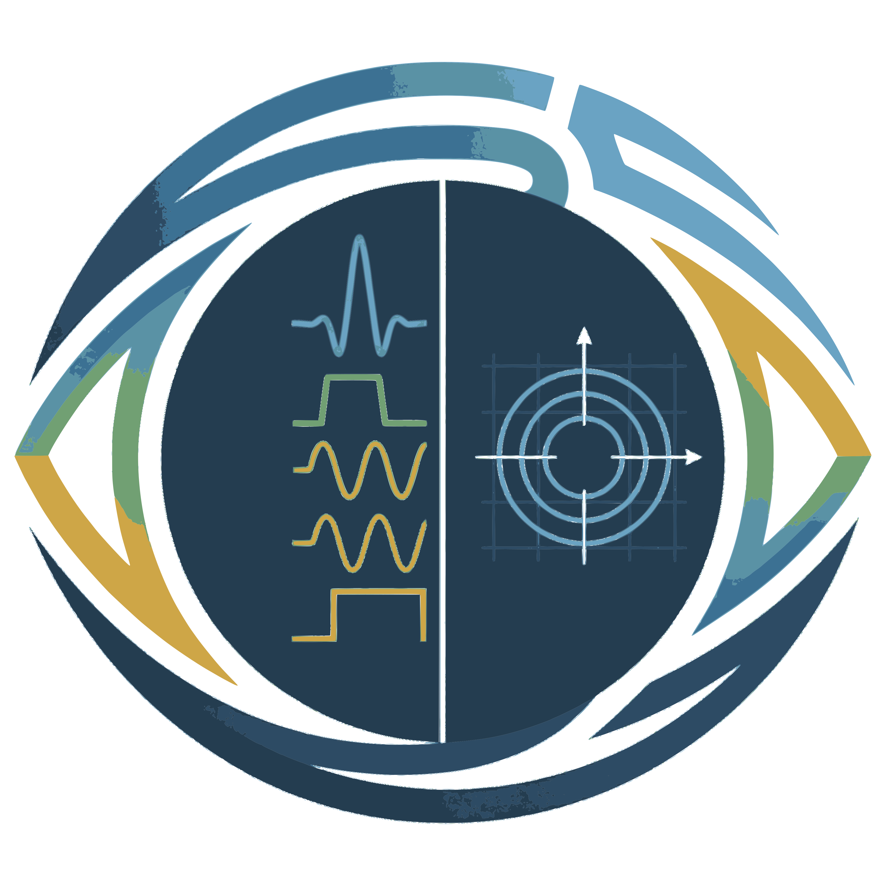

# SeqEyes Online — Pulseq MRI Sequence Viewer

**Visualize [Pulseq](https://github.com/pulseq/pulseq) MRI sequences — in your browser, MATLAB, or VS Code.** Open text `.seq` or official binary `.bseq` files, then inspect RF pulses, gradients, ADC readouts, and triggers with interactive zoom & pan. Includes a GPU‑accelerated 3D k‑space viewer with camera presets. Inspired by [SeqEyes](https://github.com/xingwangyong/seqeyes).

<p align="center">
  <a href="https://bughht.github.io/seqeyes_plugin/"><strong>🌐 Try it Online — No Install Required</strong></a>
</p>

<p align="center">
  
</p>

<p align="center">
  <a href="https://bughht.github.io/seqeyes_plugin/"></a>
  <a href="https://marketplace.visualstudio.com/items?itemName=SeqEyesDeveloper.seqeyes-web"></a>
  <a href="https://github.com/bughht/seqeyes_plugin/blob/main/LICENSE.txt"></a>
</p>

## 🌐 Web Version — Try It Now!

**[→ bughht.github.io/seqeyes_plugin](https://bughht.github.io/seqeyes_plugin/)**

No download, no extension, no setup. Just drag & drop a `.seq` or `.bseq` file and explore:

- **Drag & drop** a `.seq` or `.bseq` file onto the page (or click **📂 Open**)
- **All the same features** as the VS Code extension — sequence channels, optional M1/PNS, k‑space viewer, 6 themes, tooltips
- **GPU‑accelerated** 3D k‑space rendered in your browser via WebGL
- **Zero‑dependency parsing** — the Pulseq engine runs entirely in the browser
- **Local files stay local** — parsing and calculation run in browser memory without uploading sequence data

## VS Code Extension

Deep integration with VS Code — `.seq` and `.bseq` files open automatically in the custom editor.

### Install

From the [Marketplace](https://marketplace.visualstudio.com/items?itemName=SeqEyesDeveloper.seqeyes-web):

```
code --install-extension SeqEyesDeveloper.seqeyes-web
```

Or build from source:

```bash
git clone https://github.com/bughht/seqeyes_plugin.git
cd seqeyes_plugin
npm install
npm run package
code --install-extension seqeyes-web-*.vsix --force
```

Or press **F5** to launch Extension Development Host.

## 🧪 MATLAB Toolbox

Open in-memory Pulseq sequences, text `.seq` files, or binary `.bseq` files directly inside MATLAB — call `seqeyes(seq)`, double-click a file in the Current Folder browser, or open an empty viewer with `seqeyes()`.

### Setup

Choose one of these two MATLAB setup paths.

**Option 1: Install the toolbox.** Download `seqeyes-*.mltbx` from [GitHub Releases](https://github.com/bughht/seqeyes_plugin/releases) and double-click to install, or run:

```matlab
matlab.addons.toolbox.installToolbox('seqeyes-<version>.mltbx')
```

The installed toolbox is self-contained for MATLAB: it includes `seqeyes.m` and the bundled web viewer assets, so you do not need to keep a GitHub checkout after installing it.

**Option 2: Use the source checkout.** Clone or download this repository, then add its `matlab` folder to the MATLAB path:

```matlab
addpath(genpath('/path/to/seqeyes_plugin/matlab'))
```

This source setup does not require installing the `.mltbx`; `seqeyes(seq)` uses the web assets from the checkout.

### Usage

```matlab
seqeyes(seq)                  % open an in-memory mr.Sequence object
seqeyes('spiral_inout.seq')   % open a saved .seq file
open('spiral_inout.seq')      % or double-click in Current Folder
seqeyes('gre.bseq')           % open a saved binary .bseq file
open('gre.bseq')              % or double-click in Current Folder
```

No manual `.seq` export is needed for `mr.Sequence` objects; SeqEyes writes a temporary file internally and does not modify Pulseq files or classes. All the same features as the browser & VS Code versions — 7 channels, k-space viewer, themes, tooltips — rendered inside a native MATLAB figure. Requires R2022a+.

## 🐍 Python Package

Interactive Pulseq sequence viewer for Jupyter notebooks and Python scripts — a drop‑in replacement for `pypulseq.Sequence.plot()`. Renders directly in notebook cell output or opens in your default browser.

### Install

```bash
pip install seqeyes-python
```

For pypulseq integration:

```bash
pip install seqeyes-python[pypulseq]
```

### Usage

```python
import seqeyes

# Enable SeqEyes (once per session) — seq.plot() is now interactive
seqeyes.set(theme="dark", time_disp="ms")

# Build your sequence with pypulseq as usual
seq.plot()                          # interactive viewer in Jupyter
seq.plot(show_blocks=True)          # per‑call overrides
seq.plot(time_range=(0, 0.05))      # zoom to first 50 ms

# Restore matplotlib at any time
seqeyes.reset()
```

All the same features as the other versions — interactive waveforms, k‑space viewer, themes, tooltips — rendered directly in Jupyter or your browser. Requires Python ≥ 3.9.

## Features

- **Custom editor for `.seq` and `.bseq` files** — opens automatically on double‑click
- **📂 Open button** — switch between sequences without closing the editor
- **Browser URL import** — open raw `.seq` or `.bseq` files from web links in the standalone web app; fetched bytes stay in browser memory
- **7 primary channels**: RF · φ · Gx · Gy · Gz · ADC · Trigger
- **Optional M1 channels**: calculate M1x, M1y, and M1z on demand
- **Optional SAFE PNS prediction**: load a user-provided Siemens ASC profile to display PNS X/Y/Z/Norm
- **ADC phase curve** on φ axis — continuous $\phi(t) = \phi_0 + 2\pi \cdot f_{offset} \cdot (t - t_0)$
- **K‑space viewer**: WebGL‑accelerated 3D scatter (millions of points @ 60 fps) with camera presets
- **Camera presets** (xy / xz / yz) rotate the 3D view; any drag reverts to free 3D
- **Interactive Canvas**: cursor‑anchored time zoom, per‑row y‑axis zoom, drag‑pan, hover tooltips
- **6 built‑in themes**: One Light · One Dark · Dracula · Nord · GitHub Light · GitHub Dark (+ system auto)
- **Vertical cursor** with live time readout
- **Unit switchers** for time (s / ms / µs) and gradient (Hz/m / mT/m / G/cm)
- **K‑space unit toggle** (1/m ↔ rad/m) with auto‑updating axis ticks
- **Block boundary lines** — toggle in toolbar
- **Optimized for large files** — binary k‑space encoding, bounds-checked parsers, and no text conversion for `.bseq`
- **Pulseq format support** — text `.seq` v1.2.0–v1.5.x and official binary `.bseq` v1.5.2 reading
- **Current `.bseq` hosts** — standalone web, VS Code, MATLAB `seqeyes('file.bseq')`, Python `SeqEyesViewer.from_file()`, and the k-space export CLI

## Usage

| Action | How |
|--------|-----|
| Open a `.seq` or `.bseq` file | Double‑click in Explorer, or click **📂 Open** in toolbar |
| Switch to another sequence | **📂 Open** button (top‑left) |
| Open a browser web link | In the standalone web app, click **🌐 URL** and paste a raw `.seq` or `.bseq` link |
| Zoom waveform | Scroll wheel or toolbar `+` / `−` |
| Zoom waveform y‑axis | `Ctrl` + scroll wheel over a waveform row |
| Fine wheel zoom | Hold `Alt` while scrolling; `Ctrl` + `Alt` + scroll gives finer y‑axis zoom where supported by the browser/OS |
| Pan waveform | Click & drag |
| Fit to view | Toolbar `Fit` |
| Toggle channel | Click legend label |
| Calculate M1 | Select any `M1x`, `M1y`, or `M1z` legend entry; use the legend to toggle each axis |
| Calculate PNS | `Select PNS ASC file`, then choose a valid scanner ASC profile; use the `PNS` legend entry to toggle the axis |
| Toggle block boundaries | Checkbox `☐ Blocks` in toolbar |
| Block details & values | Hover waveform |
| Switch theme | Toolbar `Theme` dropdown |
| Toggle k‑space panel | Toolbar `K‑Space` button |
| Rotate 3D view | Left‑drag in k‑space panel |
| Pan 3D view | Right‑drag or middle‑drag |
| Zoom k‑space (at cursor) | Scroll wheel in k‑space panel |
| Cycle camera preset | `Prj` button — xy → xz → yz → 3D |
| Reset k‑space view | `↺` button |
| Toggle k‑space unit | `Unit` button — 1/m ↔ rad/m |
| ADC marker size | `Size` slider in k‑space panel |
| Resize k‑space panel | Drag left edge handle |

## License

MIT © [Bughht](https://github.com/bughht)

SAFE PNS prediction components are distributed under the BSD 3-Clause License.
See [THIRD_PARTY_NOTICES.md](THIRD_PARTY_NOTICES.md). PNS output is an advisory
prediction, not a clinical, scanner-vendor, or regulatory safety certification.

The `.bseq` reader behavior and committed parser fixtures are derived from the
MIT-licensed [pulseq/pulseq](https://github.com/pulseq/pulseq) reference
implementation. SeqEyes currently reads `.bseq`; it does not write or convert
binary sequence files.
