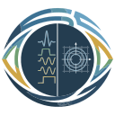

# SeqEyes Plugin

Visualize [Pulseq](https://github.com/pulseq/pulseq) MRI sequences inside VS Code — inspect RF pulses, gradients, ADC readouts, and triggers with interactive zoom & pan. Inspired by [SeqEyes](https://github.com/xingwangyong/seqeyes).



## Features

- **Custom editor for `.seq` files** — opens automatically on double‑click
- **7 toggle‑able channels**: RF · φ · Gx · Gy · Gz · ADC · Trigger
- **Interactive Canvas**: scroll‑zoom, drag‑pan, hover tooltips
- **Vertical cursor** with live time readout
- **Unit switchers** for time (s / ms / µs) and gradient (Hz/m / mT/m / G/cm)
- **Block boundary lines** — toggle in toolbar, default off
- **Dark mode** — auto‑detects VS Code theme
- **Pulseq v1.2.0 – v1.5.1** support

## Install

```bash
npm install && npm run compile && npx vsce package
code --install-extension seqeyes-plugin-0.0.1.vsix --force
```

Or press **F5** for Extension Development Host.

## Usage

| Action | How |
|--------|-----|
| Open a `.seq` file | Double‑click in Explorer |
| Zoom | Scroll wheel or toolbar `+` / `−` |
| Pan | Click & drag |
| Fit to view | Toolbar `Fit` |
| Toggle channel | Click legend label |
| Toggle block boundaries | Checkbox `☐ Blocks` in toolbar |
| Block details | Hover waveform |
| Time cursor | Move mouse |

## License

MIT
