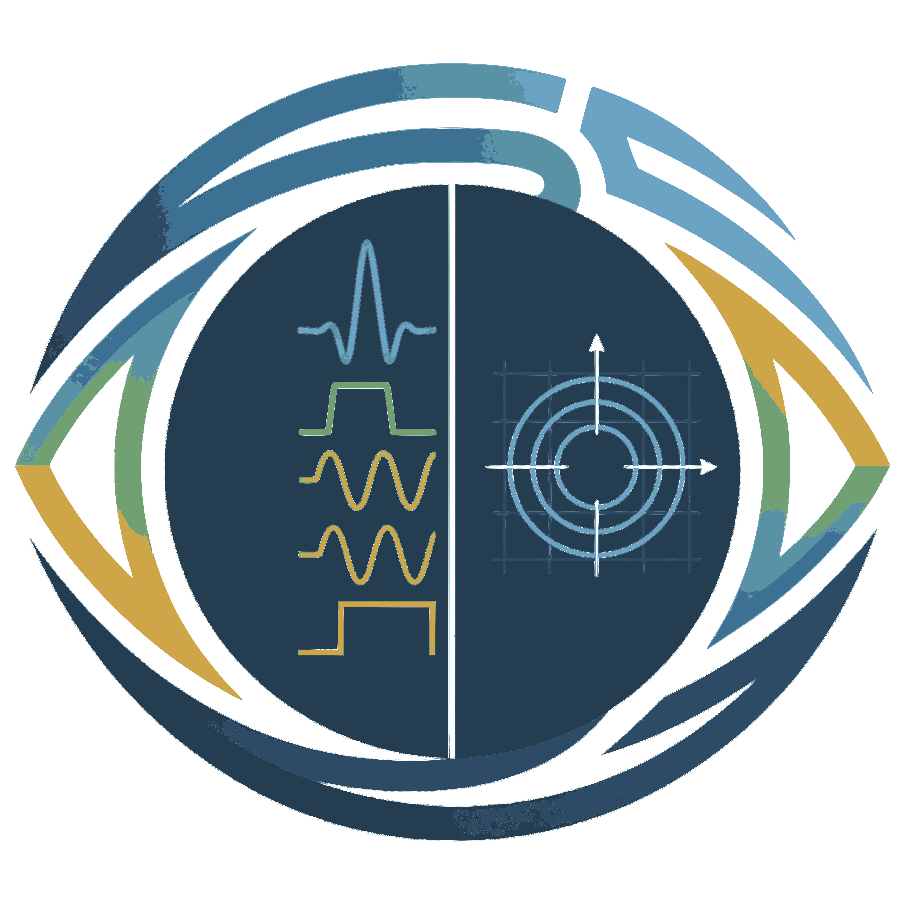

# SeqEyes Online — Pulseq MRI Sequence Viewer

**Visualize [Pulseq](https://github.com/pulseq/pulseq) MRI sequences — in your browser, MATLAB, or VS Code.** Open text `.seq` or official binary `.bseq` files, then inspect RF pulses, gradients, ADC readouts, and triggers with interactive zoom & pan. Includes a GPU‑accelerated 3D k‑space viewer with camera presets. Inspired by [SeqEyes](https://github.com/xingwangyong/seqeyes).

<p align="center">
  <a href="https://bughht.github.io/seqeyes_plugin/"><strong>🌐 Try it Online — No Install Required</strong></a>
</p>

<p align="center">
  
</p>

<p align="center">
  <a href="https://bughht.github.io/seqeyes_plugin/"></a>
  <a href="https://marketplace.visualstudio.com/items?itemName=SeqEyesDeveloper.seqeyes-web"></a>
  <a href="https://github.com/bughht/seqeyes_plugin/blob/main/LICENSE.txt"></a>
</p>

## 🌐 Web Version — Try It Now!

**[→ bughht.github.io/seqeyes_plugin](https://bughht.github.io/seqeyes_plugin/)**

No download, no extension, no setup. Just drag & drop a `.seq` or `.bseq` file and explore:

- **Drag & drop** a `.seq` or `.bseq` file onto the page (or click **📂 Open**)
- **All the same features** as the VS Code extension — sequence channels, optional M1/PNS, k‑space viewer, 6 themes, tooltips
- **GPU‑accelerated** 3D k‑space rendered in your browser via WebGL
- **Zero‑dependency parsing** — the Pulseq engine runs entirely in the browser
- **Local files stay local** — parsing and calculation run in browser memory without uploading sequence data

## VS Code Extension

Deep integration with VS Code — `.seq` and `.bseq` files open automatically in the custom editor.

### Install

From the [Marketplace](https://marketplace.visualstudio.com/items?itemName=SeqEyesDeveloper.seqeyes-web):

```
code --install-extension SeqEyesDeveloper.seqeyes-web
```

Or build from source:

```bash
git clone https://github.com/bughht/seqeyes_plugin.git
cd seqeyes_plugin
npm install
npm run package
code --install-extension seqeyes-web-*.vsix --force
```

Or press **F5** to launch Extension Development Host.

## 🧪 MATLAB Toolbox

Open in-memory Pulseq sequences, text `.seq` files, or binary `.bseq` files directly inside MATLAB — call `seqeyes(seq)`, double-click a file in the Current Folder browser, or open an empty viewer with `seqeyes()`.

### Setup

Choose one of these two MATLAB setup paths.

**Option 1: Install the toolbox.** Download `seqeyes-*.mltbx` from [GitHub Releases](https://github.com/bughht/seqeyes_plugin/releases) and double-click to install, or run:

```matlab
matlab.addons.toolbox.installToolbox('seqeyes-<version>.mltbx')
```

The installed toolbox is self-contained for MATLAB: it includes `seqeyes.m` and the bundled web viewer assets, so you do not need to keep a GitHub checkout after installing it.

**Option 2: Use the source checkout.** Clone or download this repository, then add its `matlab` folder to the MATLAB path:

```matlab
addpath(genpath('/path/to/seqeyes_plugin/matlab'))
```

This source setup does not require installing the `.mltbx`; `seqeyes(seq)` uses the web assets from the checkout.

### Usage

```matlab
seqeyes(seq)                  % open an in-memory mr.Sequence object
seqeyes('spiral_inout.seq')   % open a saved .seq file
open('spiral_inout.seq')      % or double-click in Current Folder
seqeyes('gre.bseq')           % open a saved binary .bseq file
open('gre.bseq')              % or double-click in Current Folder
```

No manual `.seq` export is needed for `mr.Sequence` objects; SeqEyes writes a temporary file internally and does not modify Pulseq files or classes. All the same features as the browser & VS Code versions — 7 channels, k-space viewer, themes, tooltips — rendered inside a native MATLAB figure. Requires R2022a+.

## 🐍 Python Package

Interactive Pulseq sequence viewer for Jupyter notebooks and Python scripts — a drop‑in replacement for `pypulseq.Sequence.plot()`. Renders directly in notebook cell output or opens in your default browser.

### Install

```bash
pip install seqeyes-python
```

For pypulseq integration:

```bash
pip install seqeyes-python[pypulseq]
```

### Usage

```python
import seqeyes

# Enable SeqEyes (once per session) — seq.plot() is now interactive
seqeyes.set(theme="dark", time_disp="ms")

# Build your sequence with pypulseq as usual
seq.plot()                          # interactive viewer in Jupyter
seq.plot(show_blocks=True)          # per‑call overrides
seq.plot(time_range=(0, 0.05))      # zoom to first 50 ms

# Restore matplotlib at any time
seqeyes.reset()
```

All the same features as the other versions — interactive waveforms, k‑space viewer, themes, tooltips — rendered directly in Jupyter or your browser. Requires Python ≥ 3.9.

## Features

- **Custom editor for `.seq` and `.bseq` files** — opens automatically on double‑click
- **📂 Open button** — switch between sequences without closing the editor
- **Browser URL import** — open raw `.seq` or `.bseq` files from web links in the standalone web app; fetched bytes stay in browser memory
- **7 primary channels**: RF · φ · Gx · Gy · Gz · ADC · Trigger
- **Optional M1 channels**: calculate M1x, M1y, and M1z on demand
- **Optional SAFE PNS prediction**: load a user-provided Siemens ASC profile to display PNS X/Y/Z/Norm
- **Gradient spectrogram**: time × frequency content of the *physical* (rotation-applied) gradient waveforms over exactly the visible time window, with a frequency-spectrum sub-pane, selectable colormaps, and radiology-style window/level
- **Acoustic resonance bands**: forbidden bands read from the same ASC profile, overlaid on both sub-panes
- **Simulated gradient sound**: play the visible window with a playhead that tracks the audio clock (simulated, not calibrated — see the caveat below)
- **ADC phase curve** on φ axis — continuous $\phi(t) = \phi_0 + 2\pi \cdot f_{offset} \cdot (t - t_0)$
- **Analysis panel**: one panel, three states — closed, WebGL‑accelerated 3D k‑space scatter (millions of points @ 60 fps) with camera presets, or the gradient spectrogram
- **Bloch simulation (preview, web app)**: simulate the sequence on the built-in, MRzero/BrainWeb or your own phantom in the browser, browse raw data, k-space and images in an N-D viewer, export ISMRMRD (`.h5`) or NumPy — see [Simulation](#simulation-preview-standalone-web-app)
- **Camera presets** (xy / xz / yz) rotate the 3D view; any drag reverts to free 3D
- **Interactive Canvas**: cursor‑anchored time zoom, per‑row y‑axis zoom, drag‑pan, hover tooltips
- **6 built‑in themes**: One Light · One Dark · Dracula · Nord · GitHub Light · GitHub Dark (+ system auto)
- **Vertical cursor** with live time readout
- **Unit switchers** for time (s / ms / µs) and gradient (Hz/m / mT/m / G/cm)
- **K‑space unit toggle** (1/m ↔ rad/m) with auto‑updating axis ticks
- **Block boundary lines** — toggle in toolbar
- **Remembered settings** — theme, units, toggles, panel sizes and the loaded ASC profile come back next session; a ⚙ toolbar button turns that off and throws away what is stored
- **Optimized for large files** — binary k‑space encoding, bounds-checked parsers, and no text conversion for `.bseq`
- **Pulseq format support** — text `.seq` v1.2.0–v1.5.x and official binary `.bseq` v1.5.2 reading
- **Current `.bseq` hosts** — standalone web, VS Code, MATLAB `seqeyes('file.bseq')`, Python `SeqEyesViewer.from_file()`, and the k-space export CLI

## Gradient spectrogram and acoustic bands

The analysis panel has three states, cycled by one toolbar button: closed,
k-space trajectory, and gradient spectrogram.

### What the spectrogram shows

The time × frequency content of the three **physical** gradient axes — the
logical channels with each block’s rotation extension applied, because acoustic
behaviour is a property of the coils, not of the logical axes. Values are
magnitudes in mT/m (or T/m/s for `dG/dt`), displayed in dB, and the fourth
trace in the spectrum sub-pane is the root-sum-of-squares across the axes.

It is computed over **exactly the time window the waveform panel is showing**,
and recomputed as you pan and zoom. This is a deliberate departure from
pulseq’s `mr.Sequence.gradSpectrum`, which averages over 50 ms segments of the
whole sequence: that average can be diluted by dummy scans, preparation blocks
and quiet stretches, so a sequence with a real resonance excitation inside one
TR can be padded until it looks compliant. Keeping the full matrix means a hot
20 ms shows up as a hot column.

The readout under the panel always states the resolution actually achieved
(`dt`, `df`), because a heavily zoomed view genuinely cannot resolve fine
frequency detail, and the panel says so rather than implying otherwise.

### Acoustic resonance bands

`Load ASC (PNS/Acoustic)` reads both the SAFE PNS coefficients and the acoustic
resonance table from a Siemens ASC profile. The two are parsed independently:
a profile carrying only one of them still loads, and the viewer reports which
it found. Bands are drawn as translucent spans across both sub-panes, in a
fixed warning colour so they never blend into the active colormap.

When gradient energy inside a band renders at the top of the current display
window, the band edge is highlighted and the viewer says so. **This is
advisory.** It compares against your current window/level setting, not against
a scanner limit, and it is not a compliance check.

### Simulated gradient sound

The play button synthesises audio from the physical gradient waveforms,
following pulseq’s `Sequence.sound()`: x to the left channel, y to the right,
z split between them, lightly smoothed and peak-normalised.

**This is simulated, not calibrated.** It reproduces the spectral character of
the gradient waveform. It is not sound pressure level, and it says nothing
about how loud the scanner will actually be — that would need the coil transfer
function, which the ASC does not contain. Windows shorter than 250 ms loop so
there is something to hear; windows longer than 120 s are refused.

### Limits

The spectrogram is scoped to the visible window, so when a request exceeds the
interactive budget the viewer asks you to zoom in rather than offering a
“calculate anyway” override — unlike whole-sequence k-space, zooming always
solves it. For the same reason the spectrogram stays available on sequences
where k-space is refused, and the k-space safety dialog offers it as a way out.

## Simulation (preview, standalone web app)

The **Simulation** toggle next to the k-space/spectrogram button runs a Bloch
simulation of the open sequence on a phantom, entirely in your browser
(Web Workers, no server), and shows the raw data and a reconstruction.

**Phantoms**

- the built-in tissue Shepp–Logan (PD, T1, T2, T2′ and ADC at 3 T) in the
  sequence's FOV, in 2-D or as a 3-D volume (the 3-D ellipsoids). The volume
  spans the sequence's FOV along z for a 3-D sequence and is a cube
  otherwise;
- MRzero's example phantoms: the cropped 2-D brain and the BrainWeb-derived
  3-D subjects. They are downloaded from
  [MRsources/MRzero-Core](https://github.com/MRsources/MRzero-Core) (AGPL-3.0)
  only when you pick them, pinned to a commit and checked against SHA-256;
  SeqEyes does not bundle them;
- your own files: MRzero `.npz` (`PD_map`, `T1_map`, … as written by
  `generate_brainweb_phantoms`) and `.mat` (`load_mat` layout), NumPy
  `.npz`/`.npy` or MATLAB `.mat` (v5–v7) with maps named PD, T1, T2, T2prime,
  ADC, B0, B1, or NIfTI maps (`name_T1.nii.gz`, …). 3-D phantoms get a plane
  and slice selector; B0/B1 come from the file, MRzero-style synthetic maps,
  or ideal fields; synthetic receive coils give multi-coil data.

**RF pulses and the slab.** Every RF pulse goes through the same Bloch
stepping, raster cell by raster cell, with the gradients playing at the time,
its frequency and phase, and each spin's off-resonance and B1. Excitation,
refocusing, adiabatic inversion, VERSE, multiband, spectral-spatial and fat
saturation pulses need no special treatment. **Slices: auto** (the default)
also places spins along z wherever the sequence's pulses act. Each pulse's
response is measured first, and sub-slices go across its slab, or its bands
for a multiband pulse, at a spacing set by the pulse's k-space extent. A
one-voxel probe checks that spacing against a finer one. Slice profiles,
transition bands, refocusing slabs narrower than the excitation, and missing
slice rephasers then show in the signal as on a scanner. A 2-D phantom is
extruded through the slab; a 3-D phantom brings the planes its slabs reach.
**Slices: z = 0** keeps every spin in one plane, which is faster. The **RF
pulses** tab shows each pulse's measured tip angle, |Mxy|, Mz, Mx and My
across z, or against off-resonance for pulses without a z gradient, as soon
as a sequence is open.

**Engine.** **Isochromats** (the default and the reference) simulate spins in
every voxel. **Phase graph** simulates configuration states per tissue class
instead: an extended phase graph with the same exact RF, sub-slices and B0/B1
maps. Spoilers and crushers become exact bookkeeping rather than something
hundreds of spins per voxel must resolve, so it needs no spins per voxel and
converges through crushed slabs (TSE, HASTE) in a few sub-slices. On the demo
sequences it is about 5–15× faster. Voxels are uniform boxes. Each voxel's
B0 enters exactly, through the states' dephasing time; pulses use it rounded
to a few Hz. **T2′** is exact too: each state decays by e^{−|τ|/T2′}, with τ
its dephasing time counted from the pulses' centres. That is a Lorentzian line
of reversible dephasing, which spin echoes refocus. So is **diffusion**: each
state decays by e^{−bD}, with b = 4π²∫|k|²dt over its own history, Z states
included, so stimulated echoes and the diffusion damping of spoiled steady
states come out right. Continuous maps such as BrainWeb are binned into at
most 2048 tissue classes, with a note. It cannot simulate pulses played with
in-plane gradients (in-plane selective or oblique excitation); use isochromats
there.

Isochromats sum every pathway in each spin, so they weight T2′ and diffusion
by the **main echo pathway**: from each excitation, reversed by each
refocusing pulse. That is exact for gradient and spin echoes, CPMG trains and
diffusion-weighted EPI. It is approximate where other pathways carry signal:
balanced SSFP, stimulated echoes, and the diffusion damping of spoiled steady
states. Lorentzian offsets on the spins themselves were tried and dropped.
Pairing each spin with one offset undoes the spoiling cancellation (still
8–16 % off at 2048 spins per voxel), and giving every spin a full line of
offsets costs 50–100 × the spins.

**3-D.** A 3-D phantom brings every plane the sequence's slab reaches. An
excitation that is not selective along z (or no selective pulse at all)
reaches the whole volume, and every plane gets sub-slices. Sub-slices are also
close enough to resolve the readouts' z encoding. Partition encoding is
recognised by an axis on which the readouts sit on two or more planes of a
Cartesian lattice without moving within a readout. The recon then grids
k-space in 3-D and transforms all three axes. The image and k-space views get
the third axis as a dimension (a slider, or pick it for X or Y).

**Viewing the data.** Phantom maps, raw data (by the sequence's labels — LIN,
PAR, SLC, ECO, REP, … — by acquisition, or every sample in time order),
gridded k-space and images all open in one N-D viewer: pick any dimension for
X and Y (the others get sliders), show magnitude, phase, real or imaginary
part, dB, apply a centred FFT along any k or image dimension (e.g. x–ky hybrid
space), and read the waveform along X in the line plot under the image.
Hovering raw data marks that sample's time on the sequence timeline;
**⇱ Timeline** brings the selected readout into view.

**While it runs**, a progress card shows the phase (planning, simulating,
reconstructing), overall progress with an ETA and throughput, and one bar per
worker. Workers simulate strips of phantom columns through the whole
sequence, so the raw data builds up as strips finish and the image fills in
strip by strip; the result replaces the live preview when the run ends.
**Accuracy** (Accurate 2 %, Fast 5 %, Draft 10 %, Sketch 25 %) sets the
signal error a run may trade for speed.

- **Isochromats** probe the spins per voxel and the sub-slices needed to meet
  it. Long-T2 tissue such as CSF needs the most spins.
- **Phase graph**: each level is a pruning threshold and a sub-slice
  sampling, measured against Accurate on the spoiled GRE, TSE, HASTE, EPI,
  diffusion EPI, balanced SSFP and a spoiled 3-D GRE.

| Phase graph | Pruning | Sub-slices | Worst error | Speed-up |
|---|---|---|---|---|
| Fast | 3e-4 | 1.5 per resolution cell | 1 % | 1.3–2.7× |
| Draft | 1e-3 | 1 | 6 % | 1.4–3.9× |
| Sketch | 1e-2 | 0.5 | 13 % | 2.1–7.1× |

Sketch is as far as the measurements allow. Pruning above 1e-2 drops the
small transverse states of low flip angles: a 10° GRE goes 93 % wrong at
3e-2. Fewer sub-slices break slice profiles (33–85 % wrong at 0.25 per cell).

**Export**: ISMRMRD raw data (`.h5`, readable by ismrmrd-python, h5py, MATLAB
and Gadgetron), the ISMRMRD stream format, a NumPy `.npz` with data,
trajectory, labels and times, or the current view as PNG.

**What it simulates**: exact spin-domain RF on the native raster, through
the slab (see above), with relaxation, gradients, RF/ADC phase and frequency
offsets, B0 and B1 maps and receive coils. The number of spins per voxel
along a spoiled axis is measured, not guessed. A one-voxel probe per tissue
finds the count whose signal stays within 2 % of a reference that cannot
alias; long-T2 CSF in an RF-spoiled GRE needs a few hundred. Sub-slices
multiply the work. When a continuous map such as BrainWeb would take too
long, the plan takes a coarser tested spacing and says so. **Not yet**:
- anisotropic diffusion (the ADC is a scalar) and Monte Carlo diffusion in
  restricted geometries;
- dynamic pTx;
- non-Cartesian gridding (the preview recon snaps samples to the nearest
  Cartesian cell);
- the VS Code and MATLAB hosts.

## Usage

| Action | How |
|--------|-----|
| Open a `.seq` or `.bseq` file | Double‑click in Explorer, or click **📂 Open** in toolbar |
| Switch to another sequence | **📂 Open** button (top‑left) |
| Open a browser web link | In the standalone web app, click **🌐 URL** and paste a raw `.seq` or `.bseq` link |
| Zoom waveform | Scroll wheel or toolbar `+` / `−` |
| Zoom waveform y‑axis | `Ctrl` + scroll wheel over a waveform row |
| Fine wheel zoom | Hold `Alt` while scrolling; `Ctrl` + `Alt` + scroll gives finer y‑axis zoom where supported by the browser/OS |
| Pan waveform | Click & drag |
| Fit to view | Toolbar `Fit` |
| Toggle channel | Click legend label |
| Calculate M1 | Select any `M1x`, `M1y`, or `M1z` legend entry; use the legend to toggle each axis |
| Load an ASC profile | `Load ASC (PNS/Acoustic)`, then choose a scanner ASC. PNS coefficients and acoustic resonances are read independently — a file carrying only one still loads, and the viewer says which it found |
| Toggle block boundaries | Checkbox `☐ Blocks` in toolbar |
| Block details & values | Hover waveform |
| Switch theme | Toolbar `Theme` dropdown |
| Cycle the analysis panel | Toolbar button: closed → **K-Space** → **Spectrogram** → closed. The label always names what the next click does |
| Rotate 3D view | Left‑drag in k‑space panel |
| Pan 3D view | Right‑drag or middle‑drag |
| Zoom k‑space (at cursor) | Scroll wheel in k‑space panel |
| Cycle camera preset | `Prj` button — xy → xz → yz → 3D |
| Reset k‑space view | `↺` button |
| Toggle k‑space unit | `Unit` button — 1/m ↔ rad/m |
| ADC marker size | `Size` slider in k‑space panel |
| Resize the analysis panel | Drag the outer edge handle |
| Resize the spectrogram / spectrum split | Drag the divider between the sub-panes (3:1 by default, remembered per orientation) |
| Window / level the spectrogram | Middle-drag: horizontal = window width, vertical = level. Middle-double-click, or `Auto W/L`, resets. Two-finger drag on touch; the `W±` / `L±` buttons do the same |
| Place a time marker | Right-click the spectrogram (or long-press on touch). The spectrum sub-pane shows that column; `Esc` or `Clear marker` removes it. With no marker the sub-pane shows the view average |
| Change the frequency range | `f min` / `f max` boxes, or scroll/drag on the frequency axis; `Fit f` returns to 0–3000 Hz |
| Change colormap | Colormap dropdown — Viridis (default), Magma, Inferno, Turbo, Greyscale, Theme |
| Analyse slew rate instead of amplitude | Source dropdown: `G` → `dG/dt` |
| Play the simulated gradient sound | `▶` at the top-left of the panel. Playback runs from the marker (or the window start) to the end of the visible window |
| Stop remembering settings | ⚙ in the toolbar, then untick **Remember my settings**. **Forget stored settings** deletes what is already there |

## Remembered settings

The viewer comes back the way you left it. Theme, time and gradient units, the
`Blocks` toggle, k-space unit, projection and marker size, spectrogram
parameters, label marker styles, panel sizes and the loaded ASC profile all
survive a restart, so a session starts where the last one ended rather than at
the defaults.

How the ASC profile is kept differs by host, because the two have different
things to work with:

- **VS Code** stores the profile's *path*. The file is re-read when you open a
  sequence, so editing the ASC takes effect on the next open, and a profile you
  move or delete is quietly forgotten rather than reported as an error.
- **Standalone web and MATLAB** get a file through a picker with no re-openable
  path, so the profile's *text* is stored in the browser, up to 2 MB. Larger
  files are not kept.

Everything lives in the browser's (or the webview's) local storage under the
`seqeyes.` prefix, on your own machine. Nothing is uploaded.

### Turning it off

The ⚙ button in the toolbar opens a settings popover:

- **Remember my settings** — on by default. Unticking it deletes everything
  stored and stops new writes. Controls still work for the rest of the session;
  they just start fresh next time. Ticking it again keeps the choices you made
  while it was off.
- **Forget stored settings** — deletes what is stored, including a cached ASC
  profile, without changing the setting itself.

## License

MIT © [Bughht](https://github.com/bughht)

SAFE PNS prediction components are distributed under the BSD 3-Clause License.
See [THIRD_PARTY_NOTICES.md](THIRD_PARTY_NOTICES.md). PNS output is an advisory
prediction, not a clinical, scanner-vendor, or regulatory safety certification.

The `.bseq` reader behavior and committed parser fixtures are derived from the
MIT-licensed [pulseq/pulseq](https://github.com/pulseq/pulseq) reference
implementation. SeqEyes currently reads `.bseq`; it does not write or convert
binary sequence files.

The gradient spectrogram and the simulated gradient sound are derived from
pulseq’s `gradSpectrum.m` and `Sequence.m::sound()`, and the acoustic ASC key
names from pypulseq. See [THIRD_PARTY_NOTICES.md](THIRD_PARTY_NOTICES.md) for
the pinned revisions. Spectrogram and audio output are simulations of gradient
waveform content, not acoustic measurements or a compliance assessment.
